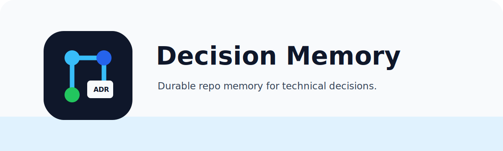

# Decision Memory Skill

<p align="center">
  
</p>

Turn important technical decisions into durable repository memory.

Convierte decisiones técnicas importantes en memoria durable del repositorio.

<p align="center">
  <a href="#english">English</a> · <a href="#español">Español</a>
</p>

<p align="center">
  <a href="https://www.skills.sh/ltorresu82/skills">
    
  </a>
</p>

## English

`decision-memory` helps coding agents decide when architecture knowledge should move
from chat, plans, reviews, or private agent memory into versioned repository memory,
usually Architecture Decision Records (ADRs).

Its main value is not only explicit usage. A compatible agent can invoke it when it
detects changes that affect architecture, service boundaries, API contracts, runtime
choices, security, deployment, or durable technical policy.

Agents can remember facts temporarily, but architecture decisions should be visible to
the whole team:

- versioned with Git;
- reviewable in pull requests;
- readable by humans and agents;
- close to the code they govern;
- explicit about accepted decisions vs candidates.

### What It Does

- Detects whether a change should create or update an ADR.
- Classifies decisions as no ADR, candidate, proposed, accepted, update, or supersede.
- Preserves existing repo conventions and ADR locations.
- Avoids marking unvalidated ideas as accepted decisions.
- Helps expose silent fallbacks, hidden technical debt, and temporary work without exit
  criteria.

### Explicit And Implicit Use

You can invoke the skill directly:

```text
Use decision-memory to review this architecture change and tell me whether it should
create an ADR, update an existing ADR, or remain as implementation documentation.
```

The stronger workflow is implicit: install the skill and let your agent apply it when a
task touches durable decisions. Good trigger signals include:

- new or changed service boundaries;
- API, event, schema, or inter-service contract changes;
- runtime, orchestration, queue, storage, search, or model-provider choices;
- auth, authorization, tenant, account, or resource-scope rules;
- deployment, gateway, environment, secret, or promotion-flow decisions;
- technical policy such as no silent fallbacks or no hidden technical debt.

### Example ADR

```md
# ADR-0007: API Gateway Owns Public Routing

## Status

Accepted

## Context

Several services expose internal HTTP APIs. Public routing needs a single owner so
clients do not depend on internal service topology.

## Decision

The API gateway owns all public HTTP routing. Services may expose internal routes, but
new public paths must be declared at the gateway boundary and documented in the API
contract.

## Consequences

Client-facing routes remain stable while internal services can evolve. Gateway changes
must be reviewed with API and deployment impact in mind.
```

### Install

With skills.sh:

```bash
npx skills add ltorresu82/skills --skill decision-memory
```

Directory page: <https://www.skills.sh/ltorresu82/skills/decision-memory>

Or copy the `skills/decision-memory/` folder into your agent's skills directory.

### Compatibility

The skill is centered on the portable `SKILL.md` format used by agent skills. It is
written to be agent-agnostic and should work in tools that can load skill folders with a
`SKILL.md`, including Codex, Claude Code, OpenCode, and other compatible agents.

### Default ADR Location

The skill uses an existing repo ADR location when present. If none exists, it recommends:

```text
docs/adr/
```

It also detects common alternatives such as `docs/adrs/`, `adr/`, `adrs/`,
`architecture/decisions/`, `docs/architecture/decisions/`, and `plans/adr/`.

## Español

`decision-memory` ayuda a agentes de código a decidir cuándo una decisión técnica debe
pasar desde el chat, planes, revisiones o memoria privada del agente hacia memoria
versionada del repositorio, normalmente mediante Architecture Decision Records (ADRs).

Su valor principal no es solo el uso explícito. Un agente compatible puede invocarla
cuando detecta cambios que afectan arquitectura, fronteras de servicio, contratos de API,
runtime, seguridad, despliegue o política técnica durable.

Los agentes pueden recordar hechos temporalmente, pero las decisiones arquitectónicas
deben quedar visibles para todo el equipo:

- versionadas con Git;
- revisables en pull requests;
- legibles por humanos y agentes;
- cerca del código que gobiernan;
- explícitas sobre decisiones aceptadas vs candidatas.

### Qué Hace

- Detecta si un cambio debe crear o actualizar un ADR.
- Clasifica decisiones como no ADR, candidata, propuesta, aceptada, actualización o
  reemplazo.
- Respeta las convenciones y ubicaciones de ADR ya existentes en el repo.
- Evita marcar ideas no validadas como decisiones aceptadas.
- Ayuda a exponer fallbacks silenciosos, deuda técnica oculta y trabajo temporal sin
  criterio de salida.

### Uso Explícito E Implícito

Puedes invocar la skill directamente:

```text
Usa decision-memory para revisar este cambio de arquitectura y decirme si debería crear
un ADR, actualizar un ADR existente o quedar como documentación de implementación.
```

El flujo más potente es implícito: instala la skill y deja que tu agente la aplique
cuando una tarea toca decisiones durables. Buenas señales de activación:

- fronteras de servicio nuevas o modificadas;
- cambios en APIs, eventos, schemas o contratos entre servicios;
- decisiones de runtime, orquestación, colas, storage, búsqueda o proveedores de modelo;
- reglas de auth, autorización, tenant, cuenta o alcance de recursos;
- decisiones de despliegue, gateway, ambientes, secretos o promoción;
- política técnica como no fallbacks silenciosos o no deuda técnica oculta.

### ADR De Ejemplo

```md
# ADR-0007: El API Gateway Es Dueño Del Enrutamiento Público

## Estado

Aceptado

## Contexto

Varios servicios exponen APIs HTTP internas. El enrutamiento público necesita un dueño
único para que los clientes no dependan de la topología interna de servicios.

## Decisión

El API gateway es dueño de todo el enrutamiento HTTP público. Los servicios pueden
exponer rutas internas, pero los nuevos paths públicos deben declararse en la frontera
del gateway y documentarse en el contrato API.

## Consecuencias

Las rutas visibles para clientes se mantienen estables mientras los servicios internos
pueden evolucionar. Los cambios de gateway deben revisarse considerando impacto de API y
despliegue.
```

### Instalación

Con skills.sh:

```bash
npx skills add ltorresu82/skills --skill decision-memory
```

Página en el directorio:
<https://www.skills.sh/ltorresu82/skills/decision-memory>

También puedes copiar la carpeta `skills/decision-memory/` al directorio de skills de tu
agente.

### Compatibilidad

La skill se basa en el formato portable `SKILL.md`. Está escrita para no depender de un
agente específico y debería funcionar en herramientas que cargan skills con `SKILL.md`,
incluyendo Codex, Claude Code, OpenCode y agentes compatibles.

### Ubicación Default Para ADRs

La skill usa la ubicación de ADRs que ya exista en el repo. Si no existe ninguna,
recomienda:

```text
docs/adr/
```

También detecta alternativas comunes como `docs/adrs/`, `adr/`, `adrs/`,
`architecture/decisions/`, `docs/architecture/decisions/` y `plans/adr/`.

## License / Licencia

MIT

## Contributing / Contribuir

See [CONTRIBUTING.md](./CONTRIBUTING.md).
